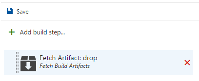
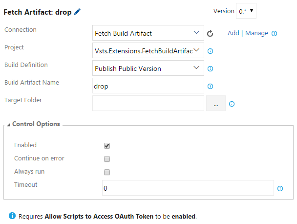
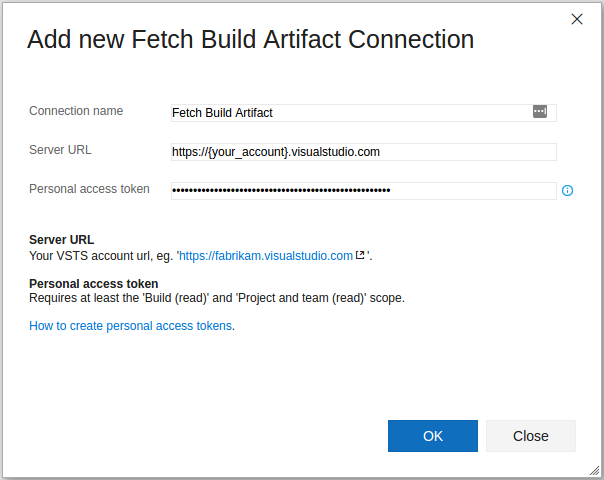

# Fetch Build Artifacts
Fetch build artifacts from any project and build definition.

## Note
This task requires **Allow Scripts to Access OAuth Token** to be **enabled**.

## Usage
Add a new **Fetch Build Artifacts** task from the **Utility** category...

...and configure it as needed.

Parameters include:
* **Connection**: Service endpoint connection to your Visual Studio Team Services account.
Click 'Add' to open the 'Add new Fetch Build Artifact Connection' dialog.

* **Project**: Project from where to fetch the build artifact.
* **Build Definition**: Build definition from where to fetch build artifact.
* **Build Artifact Name**: Name of the artifact to fetch, eg. 'drop'.
* **Target Directory**: The directory where to download the artifact. Must be an existing directory. Leaving it blank defaults to source root directory and is equal to using $(Build.SourcesDirectory).

## Changelog
* **2.0.0**: Adds dropdown menus for build definition.

Icons made by [Freepik](http://www.freepik.com) from [Flaticon](http://www.flaticon.com) is licensed by [CC 3.0 BY](http://creativecommons.org/licenses/by/3.0/)
