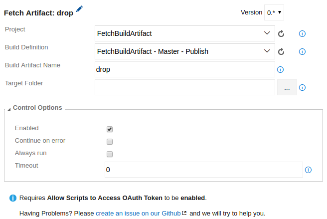

# Fetch Build Artifacts
Fetch build artifacts from server or file share, from any project and build definition, allowing the current build definition to make use of its contents.

## Note
This task requires **Allow Scripts to Access OAuth Token** to be **enabled**.

## Usage
Add a new **Fetch Build Artifacts** task from the **Utility** category...

...and configure it as needed.

Parameters include:
* **Project**: Project from where to fetch the build artifact.
* **Build Definition**: Build definition from where to fetch build artifact.
* **Build Artifact Name**: Name of the artifact to fetch, eg. 'drop'.
* **Target Directory**: The directory where to download the artifact. Leaving it blank defaults to source root directory and is equal to using <code>$(Build.SourcesDirectory)</code>. 

Example: Fetching build artifact 'drop' to target directory '$(Build.SourcesDirectory)' will create directory '$(Build.SourcesDirectory)/drop' containing the artifact contents.

## Having Problems?
Please [create an issue on our Github](https://github.com/BoolBySigma/FetchBuildArtifact/issues) and we will try to help you.

Icons made by [Freepik](http://www.freepik.com) from [Flaticon](http://www.flaticon.com) is licensed by [CC 3.0 BY](http://creativecommons.org/licenses/by/3.0/)
